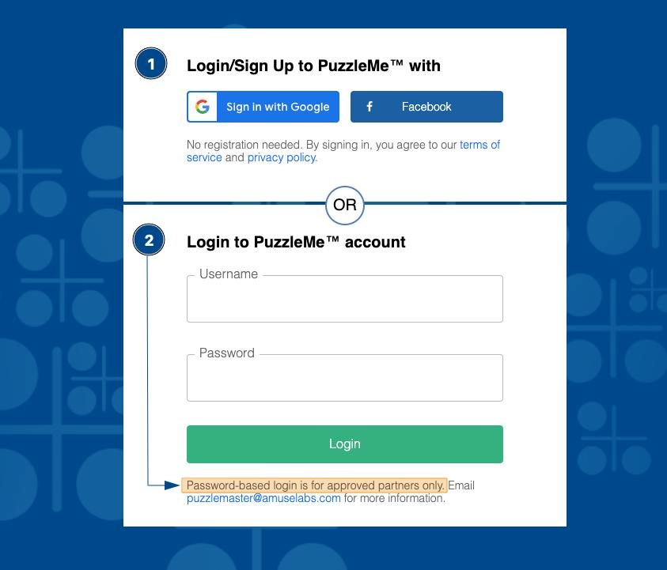
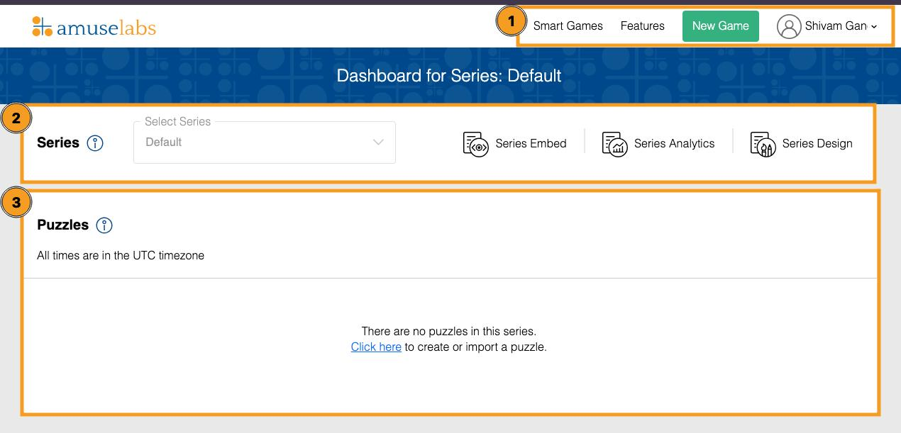

# PuzzleMe Dashboard

:::note[Objectives]

- Login to the PuzzleMe dashboard.
- Understand the different elements of the interface.

:::

## User Login

Let's start by heading to the [Login page](https://amuselabs.com/pmm/login).

<figure>
    
    <figcaption>[Login Page](https://amuselabs.com/pmm/login): (1) General login, (2) Partner login.</figcaption>
</figure>

1. **General (Free Plan)**: Login using Google/Facebook.
2. **Partners (Paid Plan)**: Login using the credentials shared with you by our onboarding team. <u>The expanded feature set will be enabled only for these accounts.</u>

:::tip[Become a Partner]
Want to become a partner? [Click here!](tbd_become_a_partner)
:::

:::info[Related]

Recently became a Partner? [Check out this FAQ!](tbd_onboarding_FAQ)

:::

## PuzzleMe Dashboard

<figure>
    
    <figcaption>[PuzzleMe Dashboard](https://amuselabs.com/pmm/dashboard): (1) Navigation Bar, (2) Series Panel, (3) Puzzle Panel.</figcaption>
</figure>

The [PuzzleMe Dashboard](https://amuselabs.com/pmm/dashboard) is the interface that enables you to create and manage all your puzzles. It contains 3 sections:
1. **Navigation Bar:** Located at the top of the page. This contains links to commonly used resources and actions.
2. **Series Panel:** This will contain information and actions relating to the current Series. For now, you can simply understand a Series as a kind of folder inside which you'll create your puzzles. 
3. **Puzzle Panel**: This will contain a list of all the puzzles that are in your current Series, along with some information and actions relating to those puzzles.

:::note[Info]
PuzzleMe Series are a fantastic tool for managing, organising, and publishing the puzzles that you create on our platform. You can find out more about them [here](tbd_terminology_series).
:::