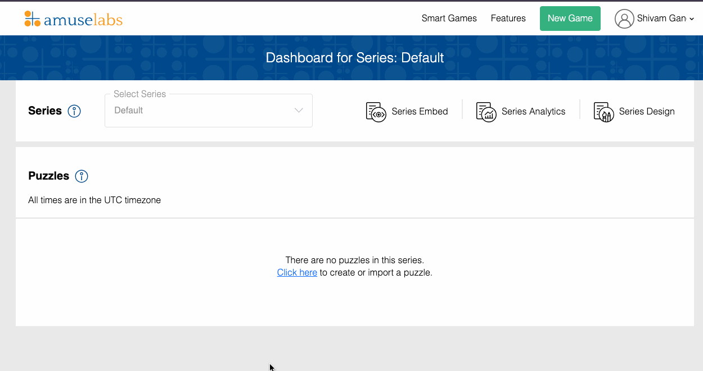
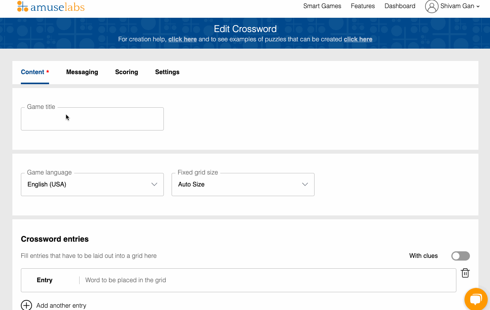
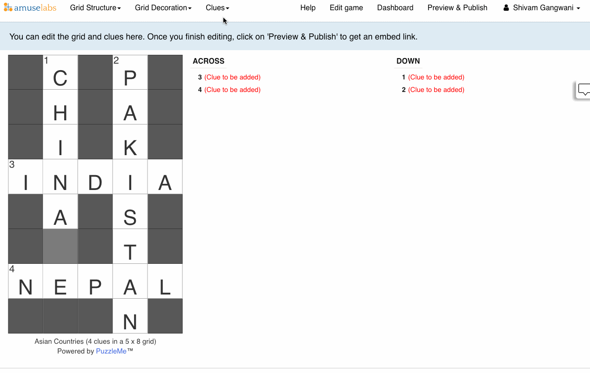
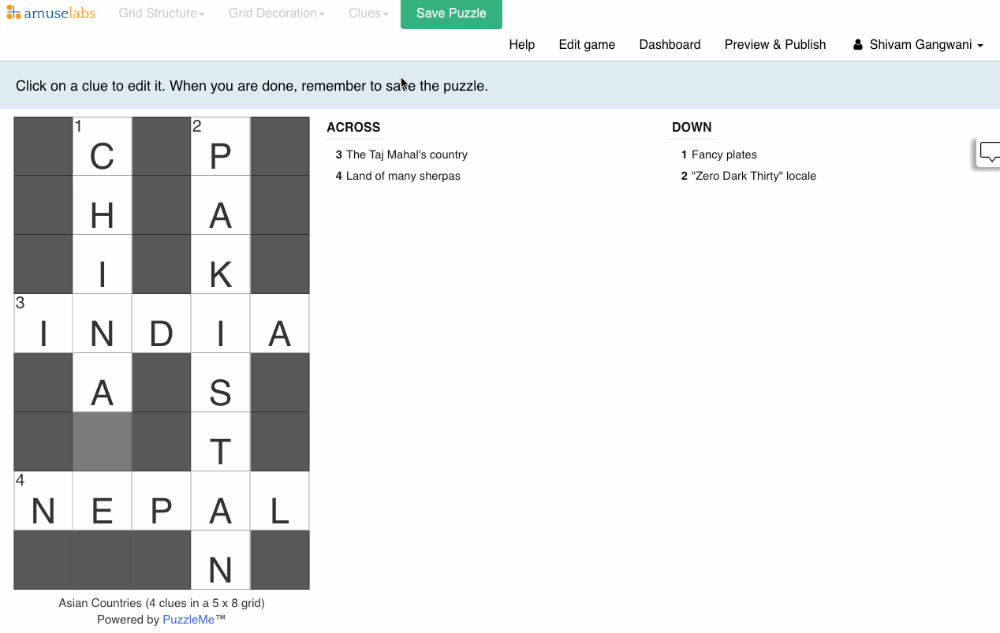

# Creating a Puzzle
:::note[Objectives]

- Create your first puzzle.

:::

Now that you're familiar with the PuzzleMe Dashboard, you're ready to create your first puzzle: **a 10-word crossword**.

## Preparation
Crosswords often center around a single theme. Before we start, we encourage you to think of a theme (such as cars, history, geography, films), and to write down 10 words related to it!

## Steps
:::info
As you move through this tutorial, you'll find several elements of the interface that we haven't mentioned here. That's for good reason: this tutorial is to show you how you can get a fully functioning puzzle with little effort.  

For detailed documentation on puzzles, [click here (TBD)](./00-get-started.md).
:::

### i. Creating a Crossword

<figure>
    
    <figcaption>Creating a Crossword</figcaption>
</figure>

1. On the PuzzleMe Dashboard, go to the Navigation Bar and **click "<u>Create Game</u>"**.

2. On the "Create Game" page, you can see the different kinds of puzzles that we offer through PuzzleMe. **For now, choose "<u>Crossword</u>"**.

### ii. Adding Words
<figure>
    
    <figcaption>Adding a Title & Words to your Crossword</figcaption>
</figure>

3. On the "Create Crossword" page, in the field labelled **"<u>Game title</u>", enter your <u>theme name</u>.**

4. Scroll down to the **"Crossword entries"** panel. **Enter your words here**, one at a time.

5. **Click the "Create Game"**. A popup appears while PuzzleMe figures out a good grid option to display your crossword. Wait until the Crossword is visible.

### iii. Adding Clues
<figure>
    
    <figcaption>Adding Clues to your Crossword</figcaption>
</figure>

6. **Click on "<u>Clues</u>" dropdown** in the Navigation Bar, and **select "<u>Edit Clues</u>"**

7. In the **Clue Panel** on the right side of the crossword, select a clue.

8. In the **"Edit Clue" popup** box, click on the **"<u>Clue Suggestions</u>" tab**. 

9. Search and select a clue. Once done, **click "<u>Save</u>" button at the bottom of the popup**.

10. **Repeat steps (7) to (9) for the remaining words**.

11. Once clues have been added for all the words, **click on "<u>Save Puzzle</u>"** in the Navigation Bar.

### iv. Finish!
<figure>
    
    <figcaption>Previewing and Playing the Crossword!</figcaption>
</figure>

12. **Click "<u>Preview and Publish</u>", and play your game!**